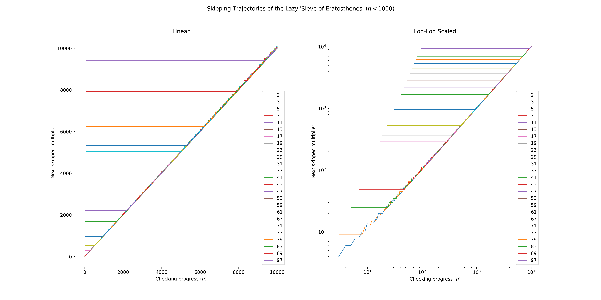

# A Lazy "Sieve of Eratosthenes"
I implemented a lazy version of the "Sieve of Eratosthenes".

## Composite Tracking

## Internal Design and Memory Efficiency
Even if `primes()` traverses the entire `u32` range, the internal `HashMap` never stores more than $6542$ entries.

### Theoretical Upper Bound
The number of entries in the `HashMap` is bounded by

$$
\pi (p)
$$

where $p$ is the largest prime satisfying

$$
p < \left\lfloor \sqrt{ 2^{32} - 1 } \right\rfloor .
$$

Breaking this down:

First, observe that $\left( 2^{16} \right) ^2 = 2^{32} > 2^{32} - 1 .$ Next,

$$
    \left( 2^{16} - 1 \right) ^2 = 2^{32} - 1 - 2 \left( 2^{16} - 1 \right) < 2^{32} - 1 .
$$

Therefore, $\left\lfloor \sqrt{ 2^{32} - 1 } \right\rfloor = 2^{16} - 1 = 65535 .$

The largest prime below $65535$ is $65521$, and $65521$ is the $6542$nd prime number.

Consequently, the iterator never holds more than $6542$ composite tracking entries at any point during execution.

This follows directly from the algorithm's design: each tracked composite corresponds to exactly one active prime $p \le \sqrt{n} .$
